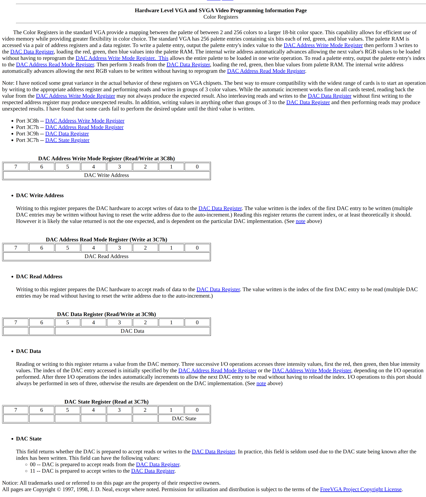

# OS30DAYS

- [Linux, GITHUB](https://github.com/torvalds/linux)
- [Linux Cross Referencer](https://elixir.bootlin.com/)

## TABLE OF CONTENT


## Section 3: Real Mode Development

## DAY1 A BOOTABLE IMAGE

### RESULT

- 

```sh
IMG=d01/helloos.img; qemu-system-x86_64 -drive file=$IMG,format=raw,if=floppy
```

- 

```sh
ASM=d01/voyager0.asm; IMG=$(mktemp) && nasm $ASM -o $IMG && qemu-system-x86_64 -drive file=$IMG,format=raw,if=floppy
```

### Edit raw img

```sh
# The first bootable image, 1440KB FDA, FAT12
dd if=/dev/zero of=os.img bs=1024 count=1440
sudo mkfs -t fat os.img
# Then modified the bytes. (with VIM XXD)
``` ### NASM to img

```sh
nasm os.nas -o os.img
```

- asm with Data Byte

```asm
DB 0xeb, 0x4e, 0x90, 0x48, 0x45, 0x4c, 0x4c, 0x4f
; ...
RESB 1469432
```

### BOOT SECTOR OF FAT

- [Boot Sector of FAT](https://en.wikipedia.org/wiki/Design_of_the_FAT_file_system#Boot_Sector)
- [Volume Boot Record](https://en.wikipedia.org/wiki/Volume_boot_record)
- [DOS 4.0 EBPB](https://en.wikipedia.org/wiki/BIOS_parameter_block)
- [Local Block Addressing (LBA)](https://en.wikipedia.org/wiki/Logical_block_addressing)

- We essentially wrote an Boot Sector of MBR?
- WHAT IS `0xeb, 0x4e, 0x90`? It is A JUMP INSTRUCTION. `JMP 0x4e; NOP;` When an address is dectected during boot, chain access will start, execution will be passed to this command. This instruction will then skip over the non-executable of the sector.
- WHAT IS `0x55, 0xaa`? It is a "boot sector signature" (see VBR). Also, 0x1fe+2 == 0x200 == 512 Byte, the end of the sector.

- the BIOS Parameter Block (BPB) used in the book is the DOS 4.0 EBPB for FAT12, FAT16, FAT16B and HPFS (51bytes).


### FAT12 EBPB, floppy disk (textbook)

- [voyager0_os.asm](./d01/voyager0.asm)


## QEMU

```sh
# to boot from a raw img
qemu-system-x86_64 -drive file=helloos.img,format=raw
# compile and boot
ASM=fat12_os.asm; IMG=$(mktemp) && nasm $ASM -o $IMG && qemu-system-x86_64 -drive file=$IMG,format=raw,if=floppy
```


## PATCH BINARY WITH VIM

```sh
nvim example.bin
:%!xxd # display as mail safe hex dump
:%!xxd -r # to revert a mail safe hex dump to binary
```


## U02 REALMODE SEGMENTED MEMORY MODEL

### Segment Memory Model

- 8086 real mode, 16 bits + Segment Registers = 1MB memory access

#### 8086 Segment Registers

- CS, Code Segment
- SS, Stack Segment
- DS, Data Segment
- ES, Extra Segment

#### Calculating Absolute Offset

- Take the segment register, multiply it by 16 and add the offset
- Example:
    - Assume: Code Segment = 0x7c0
    - Assume: Assembly Origin "org" is set to zero (when assembled, OFFSET all code by 0)
    - (0x7c0 * 16) = 0x7c00
    - 0x7c00 + 0 = 0x7c00
- Other Example:
    - Segment 0 offset 0x7cff
    - Segment 0x7c0 offset 0xff
    - Segment 0x7cf offset 0x0f
- Example that loadsb use the Data Segment Register
    - 

```asm
org 0
mov ax, 0x7c0
mov ds, ax
mov si, 0x1f
; load char from 0x7c0 * 16 + 0x1f = 0x7c1f
lodsb
```

#### ACCESS MULTIPLE SEGMENTS WITH SEGMENT REGISTERS

```asm
; set al to the byte at [es * 16 + 32]
mov byte al, [es:32]
```

- SS(Stack Segment) = 0x00
- SP(Stack Pointer) = 0x7c00
- When push 0xffff (in 16 bit system, so only 4 bytes are pushed):
    - decrement the SP by 2 => SP = 0x7bfe
    - set 0x7bfe-0x7bff to 0xffff


## U04 INTERRUPT VECTOR TABLE (IVT) (REAL MODE ONLY)

- INTERRUPTs are subroutines, when invoked:
  - Processor is interrupted
  - Old state saved on the stack
  - Interrupt executed

- The IVT table starts at the absolute address 0 in the memory.
  - Each entry contains 4 bytes (byte 0-1 OFFSET: byte 2-3 SEGMENT)
  - The interrupts are in numeric order in the table
  - The table describe 256 interrupt handlers

- An interrupt subroutine ends till an IRET instruction

- To call an interrupt, `int 0x13`
  - Interrupt 0 = address 0x00
  - Interrupt 1 = address 0x04
  - Interrupt 2 = address 0x08
  - Interrupt 0x13 = address 76

### EXCEPTIONS

- [osdev Exceptions](https://wiki.osdev.org/Exceptions)
- The exceptions are interrupts generated by **CPUs** when an 'error' occures.

## U05 DISK ACCESS AND HOW IT WORKS

- Files do not exist. Filesystems are implemented by kernel
- Implementing a filesystems requires the kernel programmer to create a filesystem driver for the target filesystem
- Data is read and written in sectors (e.g. 512 bytes)


### CHS (CYLINDER HEAD SECTOR)

- Legacy
- "head", "track", "sector"

### LBA (LOGICAL BLOCK ADDRESS)

- morden way of reading a HDD
- specify a number (sector) that start from zero

- LBA 0 = first sector on the disk
- LBA 1 = second sector on the disk

- Math: 58376 bytes
    - LBA: int(58376 / 512) = 114
    - Offset: 58376 % 512 = 8
    - 144 * 512 + 8 = 58376

### BIOS DISK ROUTINES

- In 16 bit real mode the BIOS provided interrupt 13h for disk operations
- In 32 bit protected mode we need to write our own a disk driver.

### READ CUSTOM BLOCK

- Use BIOS interrupt call 13h to interact with harddisk sectors directly
- INT 13h AH=02h: DISK - READ SECTOR(S) INTO MEMORY

## U06 INTRODUCING PROTECTED MODE

- Different level of access
    - Ring 0
    - Ring 1
    - Ring 2
    - Ring 3
        - cannot use cli sti

- Different memory scheme (Paging)
    - SELECTOR MEMORY SCHEME (?)
    - PAGING MEMORY SCHEME (Most common)

- 4GB of Addressable Memory (if 32 bit), compare to the realmode's 1MB


## U07 GCC CROSS COMPILER

- Build a customized cross compiler that does not link to default Linux library.
- [osdev gcc cross compiler](https://wiki.osdev.org/GCC_Cross-Compiler)
- Download src of `binutils` and `gcc`
- Build and install `binutils` and GCC_CROSS_COMPILER.
    - To install for the user only: `$HOME/opt/cross`
    - To install globally: `/usr/local/cross`


## SECTION 4 PROTECTED MODE DEVELOPMENT  (PROTECTED_MODE)

- Protected Mode is a mode that protect memory & hardware from being accessed.
- Protected Mode can be divided into rings with different permission level: Ring 0 (kernel), Ring 1 & 2 (maybe device drivers), Ring 3 (normal user program)
- Protected Mode also give access to 32-bit Instructions and 4 GB of Addressable Memory (in Real Mode only 1MB)
- There are different memory schemes, a common one is Paging Memory Scheme

### U09 ENTERING PROTECTED MODE

- [protected mode, osdev wiki](https://wiki.osdev.org/Protected_Mode)

#### THE FAR JMP AFTER MOV CR0

- The `jmp` runs in 32 bit protected mode.
- The `08h` is a [Segment Selector](https://wiki.osdev.org/Segment_selector), that points to the first entry of GDTR with all flag cleared
- Addressing with Segment is different in proceted mode. [Segmentation Protected Mode](https://wiki.osdev.org/Segmentation#Protected_Mode)
- I.e., `SEGMENT_SELECTOR:OFFSET`
- The next segment is `10h:Offset` or `0b10,000:Offset`

```asm
mov cr0, eax
jmp 08h:PModeMain
```

#### GLOBAL DESCRIPTOR TABLE

- SEGMENT_SELECTOR index range is 0 to 8191
    - Index			15:3
    - Table Indicator (TI)	2		; 0 for GDT, 1 for LDT
    - Ring Privilege Level	1:0
- [Segment Selector, OSDEV](https://wiki.osdev.org/Segment_Selector)
- Use default GDT parameter values
- Calculate the SEGMENT_SELECTOR in asm
- Since each Segment Descriptor is 64 bits (8 bytes).
- The following code calculate the segment selector with no flag.

```asm
CODE_SEG equ GDT_CODE - GDT_START			; Segment Selector with no flag
DATA_SEG equ GDT_DATA - GDT_START			; Segment Selector with no flag

GDT_START:
GDT_NULL:						; GDT Entry 0
    dd 0						; 4 bytes
    dd 0

; OFFSET 0x0
GDT_CODE:						; CS should point to this
    dw 0xffff						; Segment Limit, first 0-15 bits, 0xffff is 256MB in 4kb page
    dw 0						; Base Address 15:00
    db 0						; Base Address 23:16
    db 10011010b					; Common Access Byte 0x9a for Kernel Mode Code Segment
    db 11001111b					; Flags and Limit; Simply allow all memory access
    db 0						; Base 31:24

GDT_DATA:						; DS, SS, ES, FS, GS
    dw 0xffff						; Segment Limit, first 0-15 bits, 0xffff is 256MB in 4kb page
    dw 0						; Base Address 15:00
    db 0						; Base Address 23:16
    db 0x92						; Access Byte for Kernel Mode Data Segment
    db 11001111b					; Flags and Limit
    db 0						; Base 31:24
```


#### ENABLING THE A20 LINE

- A20 line exists for compatibility reasons. Enable it to access more than 1MB memory.
- [fast_A20_gate, OSDEV](https://wiki.osdev.org/A20_Line#Fast_A20_Gate)
- Enable the A20 in 32 bit code section.


## U10 USING C

- We want to write kernel in C, because it is simpler.
- Bootloader -> Load Protected Mode (use GDT to load a binary into memory segment) -> use a mini disk driver (ata read/write in LBA mode, because in Protected Mode direct IO is not allowed) to read 51.2 kb of the disk which contains our kernel binary, into a memory segment -> The binary is 32 bits, written in asm and C, sections are (4k) aligned.
- To create the binary, use a cross-compiler (binutils + gcc) for `TARGET=i686-elf`. A single object file is generated using nasm (asm part, `-f elf -g`), and gcc (C part, `-ffreestanding -g` and many other flags).
- gcc + linker script (section alignment, entry point) is used again (probably can be combined) to generate the final binary.
- Bootloader will jump to run the asm part, which will then setup the DS (according to the GDT parameters) and the stack, enable the A20 Line, then calls the C function.


### BUILD A CROSS COMPILER

- Install build dependencies [GCC_Cross-Compiler_Depencies, OSDEV](https://wiki.osdev.org/GCC_Cross-Compiler#Installing_Dependencies)
- Get the source code of binutils and gcc [Get binutils and gcc source code](https://wiki.osdev.org/GCC_Cross-Compiler#Downloading_the%20Source_Code)
- Follow the instruction to build a toolset whose `TARGET=i686-elf` [build binutils and gcc](https://wiki.osdev.org/GCC_Cross-Compiler#The_Build)

### USING C

- Seperate the 32 code, use C to generate object file.
- Link the object file, generate binary. The binary load instructions into a specific address.
- Jump to the address in the bootloader. I.e., The address can be where GDT_CODE section points to.

### ALIGNMENT

- We attached 2 binaries into 2.
- `bootloader` : `jmp 0x0100000`, which is the start of the kernel.o.
- Since kernel.asm needs to be run first (than other C code), the asm section need to be in the first section of the second binary.
- Then the kernel.asm may damage the alignment of the C code later.

- A solution: add paddings `times 512-($-$$) db 0`
- Or put the assembly code in the latest section, later than `.text` (which contains C code), then use some magic to jmp to that section first.

- Also, align all "Sections" during link time to 4KB, although C compiler usually do so by default. The 4096 bytes is also a common system page size.


## U13 C HELLO WORLD

- Use the VGA Text-mode interface to clear the screen and print.
- The Video Memory is mapped to a specific address (e.g., 0xB8000) during the boot process (probably handled by BIOS).
- [(VGA) Text Mode, OSDEV](https://wiki.osdev.org/Printing_To_Screen)

## U14 INTERRUPT DESCRIPTOR TABLE (IDT) (PROTECTED MODE INTERRUPTS)

- Initialize an array of IDT, usually IDT[256].
- Describe the array in IDTR ((length-1=0x7ff)(2 bytes) + base address (4 bytes))
- Define a interrupt handler and write the IDT array to the IDTR.
- Use `lidt[idtr]` in asm to load the Interrupt Descriptor Tables.
- Use `Int 0` to invoke an "Interrupt Gate" interrupt.
- (TODO? If IRET is necessary, this is done by asm, the IRET seems to loads many more registers from the stack than RET).

## U15 IO

- Use asm `in` && `out` instructions to write byte/word(2 bytes) to a port
- Note: AT&T syntax `out %al,(%dx)`, is equals to Intel syntax `out dx, al`, where the value in the `dx` register is the port value, despite the confusing parentheses.


## U16 PROGRAMMABLE INTERRUPT CONTROLLER (PIC)

- For each PCI controller, there are 4 "Initialization Command Words(ICWs)" need to be sent on init
- Then 3 "Operation Command Words(OCWs) can be sent"
- [8259A Datasheet](https://pdos.csail.mit.edu/6.828/2005/readings/hardware/8259A.pdf)
- ICW1, ICW2:
- 
- ICW3, ICW4:
- 
- OCWs:
- 


- [A list of Industry Standard Architecture Interrupt ReQuests, OSDEV](https://wiki.osdev.org/Interrupts#Standard_ISA_IRQs)
- [Mordern APIC, OSDEV](https://wiki.osdev.org/APIC)
- A System has 2 PICs (Master PIC: IRQ 0-7, Slave PIC: IRQ 8-15)
- Use NASM macro to create interrupt handlers in asm, passing interrupt numbers and stack frame to the C function.
- Correctly enable sti after idt is initialized


### KEYBOARD HANDLING

- [PS_2 Controller IO Ports](https://wiki.osdev.org/%228042%22_PS/2_Controller)
- 

- [scancode, atakbd](https://elixir.bootlin.com/linux/latest/source/drivers/input/keyboard/atakbd.c#L64)
- [scancode](https://hp.vector.co.jp/authors/VA003720/lpproj/others/kbdjpn.htm)
- [scancode](https://github.com/flosse/linuxconsole/blob/master/utils/scancodes.h)

- BIOS_Interruption_and_Functions.pdf:
- 


## U17 HEAP AND MEMORY MANAGEMENT

- `malloc` and `free`
- 32-bit addressing == 2**32 bytes/1024/1024/1024 == 2**2GB == 4GB address
- There are reserved addresses for:
  - Video memory
  - Hardware memory
- An array of uninitialized memory is available to us (the system?) from address "0x01000000"
- 0xc0000000 is reserved (video memory?)

### MEMORY TEST

- [Memory Test, Linux](https://github.com/torvalds/linux/blob/master/mm/memtest.c)

### HEAP

- [Simple Heap Implementations, OSDEV](https://wiki.osdev.org/User:Pancakes/SimpleHeapImplementation#Implementations)
- "Stack Based" is the best?
- "Linked List" also good


### MEMORY MAP

- Linux kernel 6.2.10 `arch/x86/kernel/e820.c`, quote:

```c
/*
 * We organize the E820 table into three main data structures:
 *
 * - 'e820_table_firmware': the original firmware version passed to us by the
 *   bootloader - not modified by the kernel. It is composed of two parts:
 *   the first 128 E820 memory entries in boot_params.e820_table and the remaining
 *   (if any) entries of the SETUP_E820_EXT nodes. We use this to:
 *
 *       - inform the user about the firmware's notion of memory layout
 *         via /sys/firmware/memmap
 *
 *       - the hibernation code uses it to generate a kernel-independent CRC32
 *         checksum of the physical memory layout of a system.
 * ...
 * Once the E820 map has been converted to the standard Linux memory layout
 * information its role stops - modifying it has no effect and does not get
 * re-propagated. So its main role is a temporary bootstrap storage of firmware
 * specific memory layout data during early bootup.
 */
```

- In short, on boot, bootloader collect memory info from platform specific hardware, then pass to the kernel.
- The "BIOS Function: INT 0x15, AX=0xE820": [Memory_map, OSDEV](https://en.wikipedia.org/wiki/Memory_map)
- The GRUB implementation: [grub_get_mmap_entry, mmap.c, GRUB](https://git.savannah.gnu.org/cgit/grub.git/tree/grub-core/kern/i386/pc/mmap.c)

```c
/*
 *
 * grub_get_mmap_entry(addr, cont) : address and old continuation value (zero to
 *		start), for the Query System Address Map BIOS call.
 *
 *  Sets the first 4-byte int value of "addr" to the size returned by
 *  the call.  If the call fails, sets it to zero.
 *
 *	Returns:  new (non-zero) continuation value, 0 if done.
 */
/* Get a memory map entry. Return next continuation value. Zero means
   the end.  */
static grub_uint32_t
grub_get_mmap_entry (struct grub_machine_mmap_entry *entry,
		     grub_uint32_t cont)
{
  struct grub_bios_int_registers regs;

  regs.flags = GRUB_CPU_INT_FLAGS_DEFAULT;

  /* place address (+4) in ES:DI */
  regs.es = ((grub_addr_t) &entry->addr) >> 4;
  regs.edi = ((grub_addr_t) &entry->addr) & 0xf;

  /* set continuation value */
  regs.ebx = cont;

  /* set default maximum buffer size */
  regs.ecx = sizeof (*entry) - sizeof (entry->size);

  /* set EDX to 'SMAP' */
  regs.edx = 0x534d4150;

  regs.eax = 0xe820;
  grub_bios_interrupt (0x15, &regs);

  /* write length of buffer (zero if error) into ADDR */
  if ((regs.flags & GRUB_CPU_INT_FLAGS_CARRY) || regs.eax != 0x534d4150
      || regs.ecx < 0x14 || regs.ecx > 0x400)
    entry->size = 0;
  else
    entry->size = regs.ecx;

  /* return the continuation value */
  return regs.ebx;
}
```

- [drivers/firmware/memmap.c](https://elixir.bootlin.com/linux/latest/source/drivers/firmware/memmap.c#L26)

```c
/*
 * Firmware map entry. Because firmware memory maps are flat and not
 * hierarchical, it's ok to organise them in a linked list. No parent
 * information is necessary as for the resource tree.
 */
struct firmware_map_entry {
	/*
	 * start and end must be u64 rather than resource_size_t, because e820
	 * resources can lie at addresses above 4G.
	 */
	u64			start;	/* start of the memory range */
	u64			end;	/* end of the memory range (incl.) */
	const char		*type;	/* type of the memory range */
	struct list_head	list;	/* entry for the linked list */
	struct kobject		kobj;   /* kobject for each entry */
};
```

- e.g. `0x00100000`-`0x00EFFFFF` (14 MB), `0x01000000`-`0xC0000000` (?MB) is some non-reserved memory space below 4GB
- [Memory Map (x86), OSDEV](https://wiki.osdev.org/Memory_Map_(x86))
- 


## U18 PAGING

- 32-bit architecture: 4KB memory block per "Entry" -> 1024 "Entries" per "Page Table" -> 1024 "Page Table" per "Page Directory"
- 4KB * 1024 * 1024 = 4GB
- `int 0x14` "Page Fault"
- [Enabling Paging, OSDEV](https://wiki.osdev.org/Paging#Enabling)

- Hardware addresses (e.g. Video memory address) cannot be mapped by paging. Probably because devices may wants to do direct IO without going through CPU.

## U19 READING HARDDISK

- ATA/ATAPI-6
- 
- [ATA PIO Mode, x86 directions, OSDEV](https://wiki.osdev.org/ATA_PIO_Mode#x86_Directions)
- [IO Ports, OSDEV](https://wiki.osdev.org/I/O_Ports)
- (?) Where is the 0x1f0 address for primary ATA harddisk controller defined? Probably exists an ISA standard.
- [ATA Harddisk Registers](https://wiki.osdev.org/ATA_PIO_Mode#Registers)
- The ATA Registers, Offset from the "I/O" base (e.g. 0x1f0):

| Offset | Direction | Function                 | Description                                         | Param. size LBA28/LBA48 |
|--------|-----------|--------------------------|-----------------------------------------------------|------------------------|
| 0      | R/W       | Data Register            | Read/Write PIO data bytes                           | 16-bit / 16-bit        |
| 1      | R         | Error Register           | Used to retrieve any error generated by the last ATA command executed. | 8-bit / 16-bit |
| 1      | W         | Features Register        | Used to control command specific interface features.| 8-bit / 16-bit        |
| 2      | R/W       | Sector Count Register    | Number of sectors to read/write (0 is a special value). | 8-bit / 16-bit |
| 3      | R/W       | Sector Number Register (LBAlo) | This is CHS / LBA28 / LBA48 specific.        | 8-bit / 16-bit        |
| 4      | R/W       | Cylinder Low Register / (LBAmid) | Partial Disk Sector address.                | 8-bit / 16-bit        |
| 5      | R/W       | Cylinder High Register / (LBAhi) | Partial Disk Sector address.                | 8-bit / 16-bit        |
| 6      | R/W       | Drive / Head Register    | Used to select a drive and/or head. Supports extra address/flag bits. | 8-bit / 8-bit |
| 7      | R         | Status Register          | Used to read the current status.                     | 8-bit / 8-bit         |
| 7      | W         | Command Register         | Used to send ATA commands to the device.             | 8-bit / 8-bit         |

- The PIO Data in protol, `0x08` (BSY = 0 & DRQ = 1)
- 


- Peripheral Component Interconnect Integrated Drive Electronics (PCI IDE)
- [PCI_IDE_Controller, OSDEV](https://wiki.osdev.org/PCI_IDE_Controller)


## U20 FILE SYSTEM

- More disk IO
  - 
  - 
- File system driver write data to a disk location in an organized way.


## B04 GRAPHIC MODES

- KEYWORDS: **INT 10H**, **VESA**, **VESA BIOS extension(VBE)**

- [INT 10H, wiki](https://en.wikipedia.org/wiki/INT_10H)
- [INT 10H, Video Mode examples, wiki](http://www.columbia.edu/~em36/wpdos/videomodes.txt)

- It is a BIOS call == only available in "REALMODE" or "VITURAL 8086 MODE".

- Video Graphics Array (VGA) ALL POINTS ADDRESSABLE (APA) Graphics
- Typically, the Video Memory is mapped as the following:

```txt
0xA0000 - 0xBFFFF For EGA/VGA video modes
0xB0000 - 0xB7777 For Monochrome text mode
0xB8000 - 0xBFFFF For Color text mode and CGA compatible graphics modes
```

- [Locating_Video_Memory](https://wiki.osdev.org/Drawing_In_a_Linear_Framebuffer#Locating_Video_Memory)
- Mode 13h: VGA 320*200 256 color

### VGA COLOR REGISTERS

- [VGA Resources, OSDEV](https://wiki.osdev.org/VGA_Resources)
- [Color Registers, Hardware Level VGA and SVGA Video Programming Information Page](http://www.osdever.net/FreeVGA/vga/colorreg.htm)

```txt
  The Color Registers in the standard VGA provide a mapping between the palette of between 2 and 256 colors to a larger 18-bit color space. This capability allows for efficient use of video memory while providing greater flexibility in color choice. The standard VGA has 256 palette entries containing six bits each of red, green, and blue values. The palette RAM is accessed via a pair of address registers and a data register. To write a palette entry, output the palette entry's index value to the DAC Address Write Mode Register then perform 3 writes to the DAC Data Register, loading the red, green, then blue values into the palette RAM. The internal write address automatically advances allowing the next value's RGB values to be loaded without having to reprogram the DAC Address Write Mode Register.  This allows the entire palette to be loaded in one write operation. To read a palette entry, output the palette entry's index to the DAC Address Read Mode Register. Then perform 3 reads from the DAC Data Register, loading the red, green, then blue values from palette RAM. The internal write address automatically advances allowing the next RGB values to be written without having to reprogram the DAC Address Read Mode Register.
```

- 


## B07 PS2 CONTROLLER (PS2KBC && PS2MOUSE)

- To enable the mouse, set the Bit 1 (Second PS/2 port interrupt) of the Configuration Byte of the PS2KBC.
- Then use the `0xD4` PS2KBC command to send the `0xF4`("Enable Data Reporting") command to the PS2MOUSE.
- Enable the IRQ12 Mask.
- [PS2KBC, OSDEV](https://wiki.osdev.org/%228042%22_PS/2_Controller)

- PS/2 Controller Commands && Configuration Byte:
- 
- 


## B14 HIDPI

- `int 0x10, ax=0x4f02` -- select VESA video modes
- [INT0x10, OSDEV](https://wiki.osdev.org/BIOS#Common_functions)
- 
- [Usage of int10h_ax4f02h, OSDEV](https://wiki.osdev.org/VESA_Video_Modes)
- 
- [VESA Modes, wiki](https://en.wikipedia.org/wiki/VESA_BIOS_Extensions)
- 

## B14 LINUX INPUT SUBSYSTEM

- [Linux Input Subsystem kernel API, doc](https://docs.kernel.org/input/input-programming.html)
- [input_dev, include/linux/input.h](https://elixir.bootlin.com/linux/latest/source/include/linux/input.h#L137)
- [input_get_disposition, drivers/input/input.c](https://elixir.bootlin.com/linux/latest/source/drivers/input/input.c#L239)


## B15 TSS AND GDT REVISIT

- Apparently the `lgdt/lidt` instructions CAN be reloaded in the protected mode

- [LGDT/LIDT, doc](https://www.felixcloutier.com/x86/lgdt:lidt)

```txt
The LGDT and LIDT instructions are used only in operating-system software; they are not used in application programs. They are the only instructions that directly load a linear address (that is, not a segment-relative address) and a limit in protected mode. They are commonly executed in real-address mode to allow processor initialization prior to switching to protected mode.
```

## ASSEMBLY

- [NASM doc](https://www.nasm.us/xdoc/2.11.08/html/nasmdoc7.html)


### SEGMENT OVERRIDE PREFIX AND DEFAULT SEGMENT

- `SS:` is a segment override prefix
- Search for "default segment" in the intel manual to see more specific rules (`Specifying a Segment Selector`), some common ones are as follows:
    - REFERENCE_TYPE      REGISTER_USED
    - Instructions        CS (TODO this is auto set to SEGMENT_SELECTOR at when?)
    - Stack               SS
    - Local_Data          DS
    - Destination_Strings ES

- Behavior different in REALMODE and PROTECTED_MODE
    - Realmode: Address = Segment * 0x10 + offset
    - Protected mode: SS as SEGMENT_SELECTOR


```asm
mov ax, 0x82
mov ds, ax
mov ax, 0x81
mov [ds:ax], 1 ; 0x82 << 4 + 0x81 == mov [0x8A1], 1
```

### FLAGS

- `CLI`: CLear Interrupt Flag (IF) (in FLAGS or EFLAGS)
- `STI`: SeT Interrupt Flag (IF) (in FLAGS or EFLAGS)


### DESCRIPTIONS OF AN INSTRUCTION

- `lgdt m16&32` vs `ltr r/m16`:
    - TL;DR: `ltr ax` and `ltr [ebp + 8]` are both OK, but `ltr[ax]` is NOT.
    - Meanwhile, `lgdt [ebp+8]` only accept a memory address.

```asm
_gdt_load_task_register:
    push ebp
    mov ebp, esp

    mov WORD ax, [ebp + 8]
    ltr ax                  ; OK
    ;ltr [ebp+8]            ; OK

    pop ebp
    ret
```


## C

### DEFINE A GLOBAl VARIABLE

- In the header file write it with `extern`. And at the global scope of one of the c files declare it without `extern`.

### ARRAY OF POINTERS VS POINTER OF AN ARRAY

- [C11 Standard - 6.7.6.2 Array declarators](http://port70.net/~nsz/c/c11/n1570.html#6.7.6.2)

```c
(a)      int			// int
(b)      int   *		// pointer to int
(c)      int   *[3]		// array of 3 pointers to int
(d)      int   (*)[3]		// pointer of an array of 3 int
(e)      int   (*)[*]		// pointer to a variable length array of an unspecified number of ints

(f)      int   *()		// function with no parameter specification returning a pointer to int
(g)      int   (*)(void)	// pointer to function with no parameters returning an int
(h)      int   (*const [])(unsigned int, ...) // array of an unspecified number of constant pointers to functions, each with one parameter that has type unsigned int and an unspecified number of other parameters, returning an int.
```


### BIT FIELDS

- [packed bit fields in c structure gcc, stackoverflow](https://stackoverflow.com/questions/25822679/packed-bit-fields-in-c-structures-gcc)
- TL;DR: The non-consecutive bit field is aligned to a byte boundary in a struct, which allows faster memory access.


- Q:

```c
struct __attribute__((packed)) {
    int a:12;
    int b:32;
    int c:4;
} t1;

struct __attribute__((packed))  {
    int a:12;
    int b;
    int c:4;
}t2;

void main()
{
    printf("%d\n",sizeof(t1)); //output - 6
    printf("%d\n",sizeof(t2)); //output - 7
}
```

- A:

```txt
Your structures are not "exactly the same". Your first one has three consecutive bit-fields, the second has one bit-field, an (non bit-field) int, and then a second bit-field.

This is significant: consecutive (non-zero width) bit-fields are merged into a single memory location, while a bit-field followed by a non-bit-field are distinct memory locations.

Your first structure has a single memory location, your second has three. You can take the address of the b member in your second struct, not in your first. Accesses to the b member don't race with accesses the a or c in your second struct, but they do in your first.

Having a non-bit-field (or a zero-length bit-field) right after a bit-field member "closes" it in a sense, what follows will be a different/independent memory location/object. The compiler cannot "pack" your b member inside the bit-field like it does in the first struct.
```

